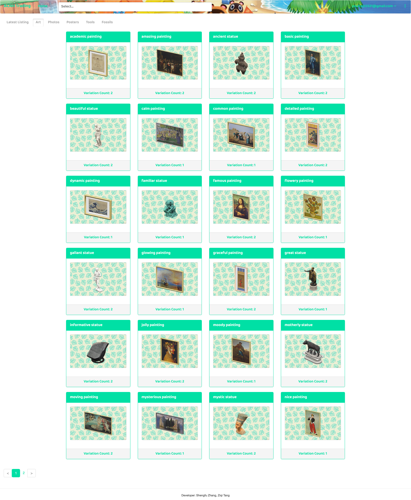
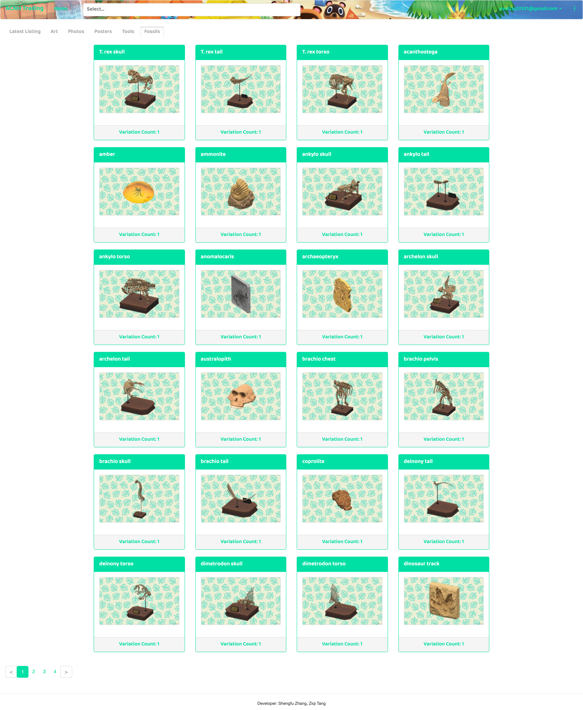
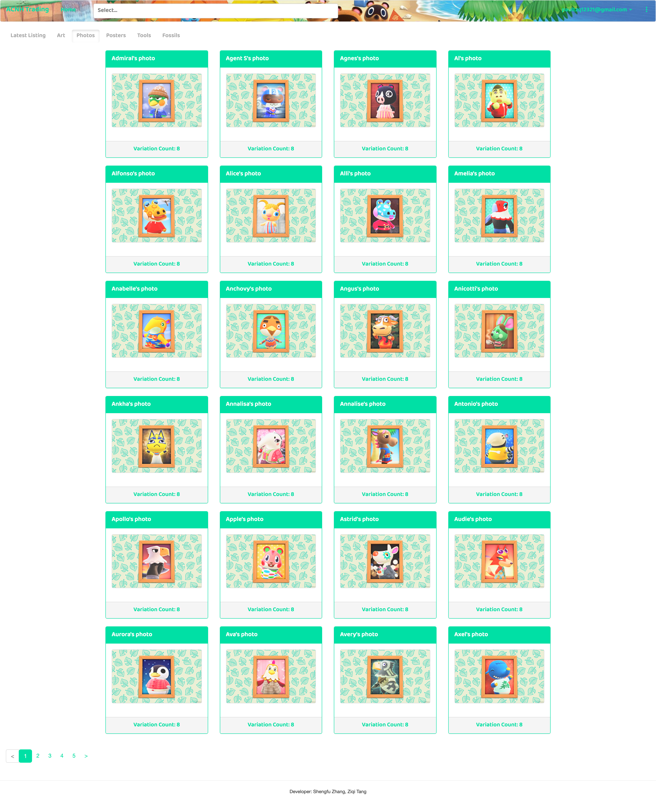
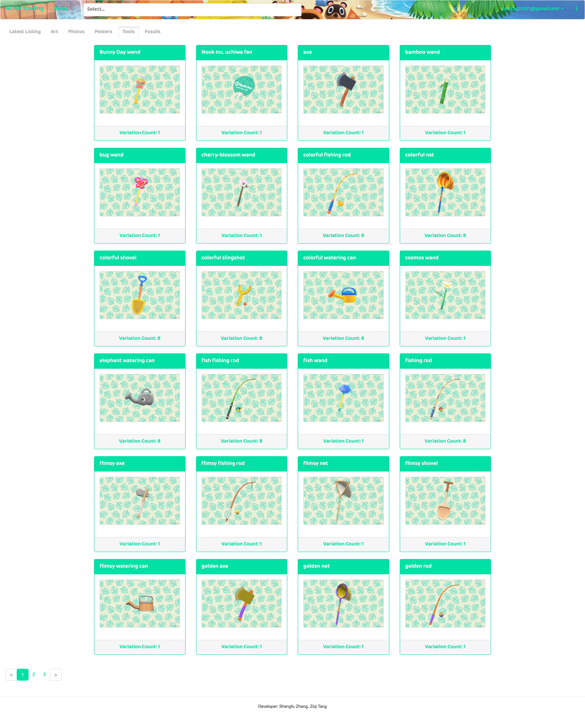
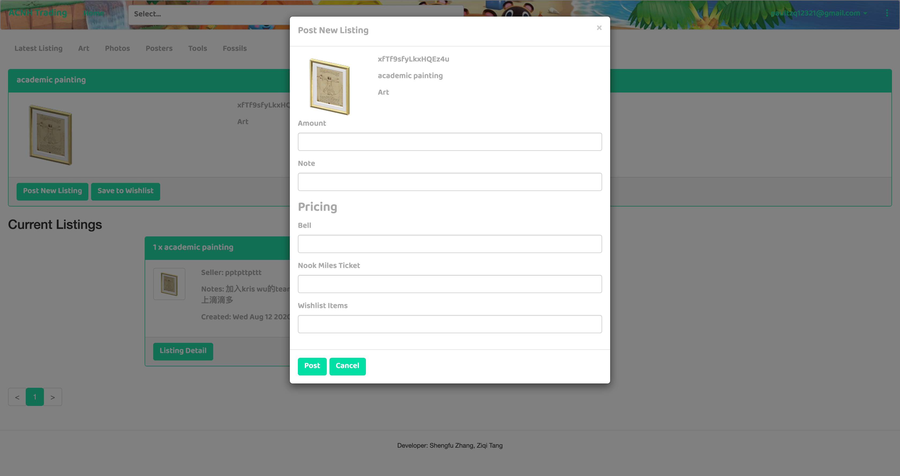
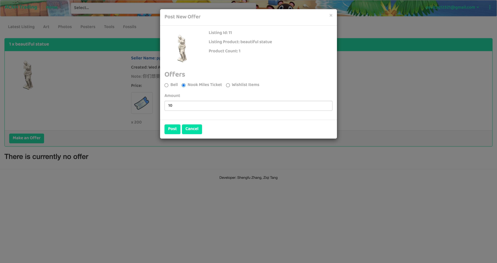
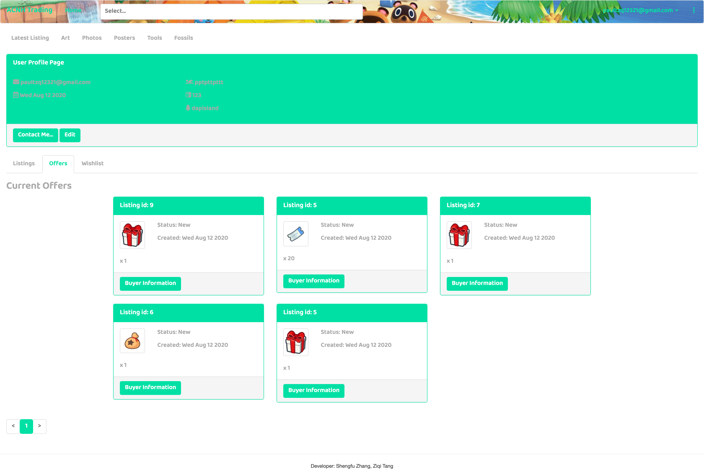
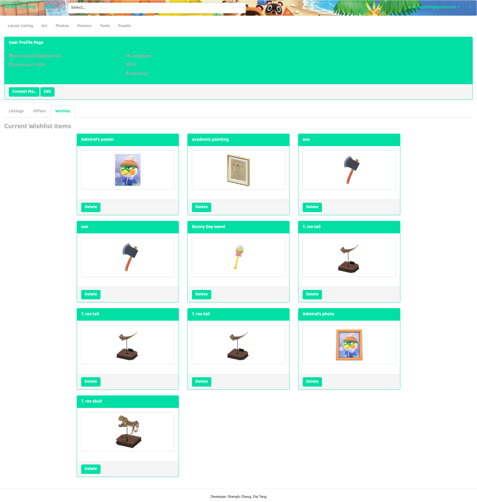
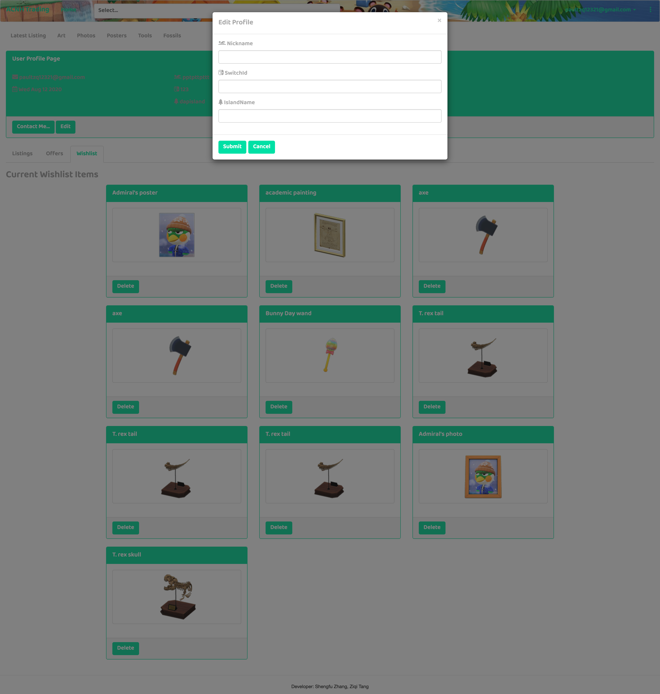
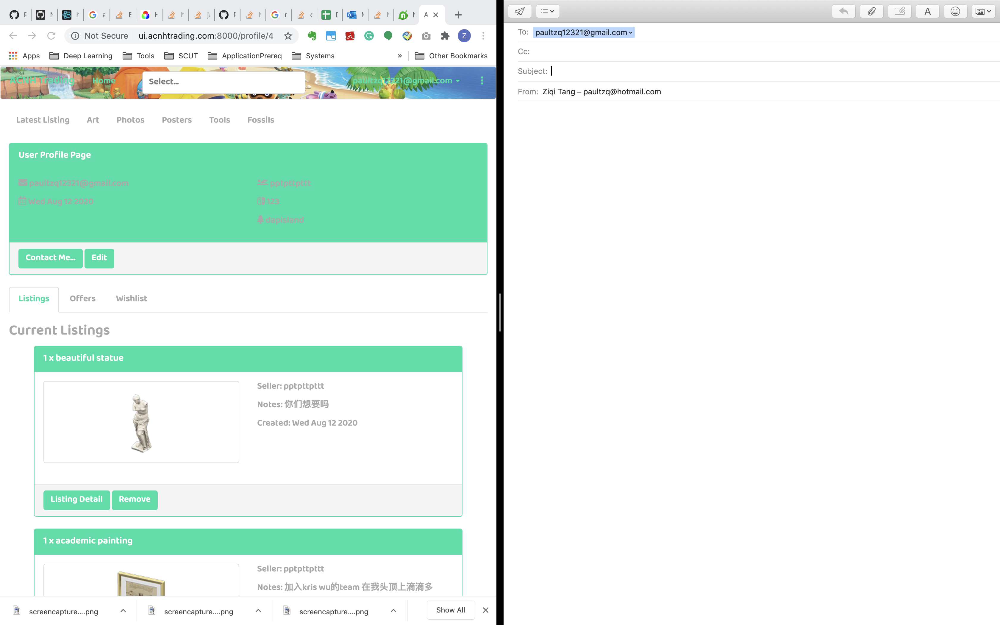

# GroupProject_ppttptsfzzsf_UI

## Team
* Shengfu Zhang
* Ziqi Tang

## Useful Links
* Links to API Repo: https://github.ccs.neu.edu/NEU-CS5610-SU20/GroupProject_ppttptsfzzsf_API.git
* Links to UI Repo: https://github.ccs.neu.edu/NEU-CS5610-SU20/GroupProject_ppttptsfzzsf_UI.git
* Links to Heroku Page: https://acnh-trading-ui.herokuapp.com/

## Final Iteration
* Shengfu Zhang:
    
* Ziqi Tang:
  - Add components to profile page to display the personal info and personal lisings/offers/wishlist.
  - Add profile listing component on the profile page using listing api call.
  - Add profile offer component on the profile page using offer api call.
  - Add modal to edit the profile info and re-render changes to profile page.
  - Change css to customize the elements like button, tab, grid, labels, etc. to unify the website theme.
  
## Final Delivery Snapshots and Descriptions
* Landing Page

* Product Page(all categories)

* Listing Page(listing post/make offers/)

* Profile Page(main page/edit modal/personal listing/personal offer/personal wishlist/contact via email)

## Iteration 2 Progress
* We created components for log in and register page.
* We created components for user profile page.
* We refactored structure for components to allow avoid redundant code.
* We used POST request to store the user info into Mongo whenever a new user is logged in.
* We created authentication-aware components for profile page.

## Iterations 1 Progress
* We used book project as the boilerplate code and build our projects on top of that.
* We found the Animal Crossing New Horizon product spreadsheet dataset and use Json 
parse tool to load into the MongoDB Altas cluster.
* We created new schemas for different queries for our Animal Crossing products and the CRUD operations.
* We added new APIs for CRUD operations in our API server.
* For UI server, we added pages for our product category lists. The user profile page is still under construction.
* For product displaying pages, we add different components for different categories where the related API is called to 
load the data and render them using Grid and Panel.

## Contribution
* Shengfu Zhang: 
    1. set up Heroku server and mongoDB
    2. create MongoDB schema for query and mutation
    3. create api for querying both single product and product list
    4. create api for adding user, offer and listing
    5. create UI for product displaying page
    6. set up router for UI server
* Ziqi Tang:
    1. create api for GET both single listing and listing list
    2. create api for updating and deleting listings and offers
    3. Test and verify graphQL query and mutations on the playground
    4. generate sample data in MongoDB
    5. create components for profile page UI

## Snapshots and Descriptions
* Home Page(for now)

* Sign in modal

* Animal Crossing official art displaying page

* Animal Crossing official photos displaying page

* Animal Crossing official posters displaying page

* Animal Crossing official tools displaying page

* Animal Crossing official fossils displaying page

