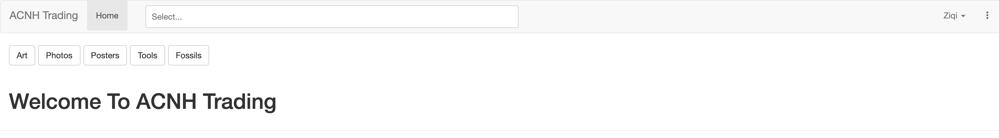
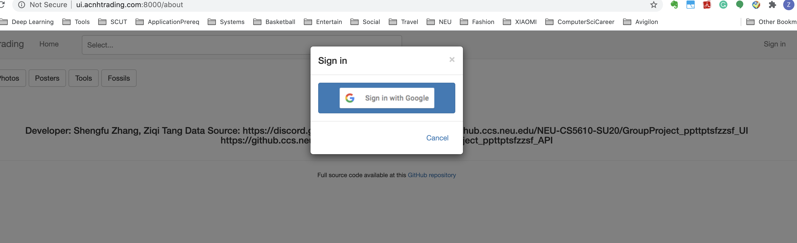
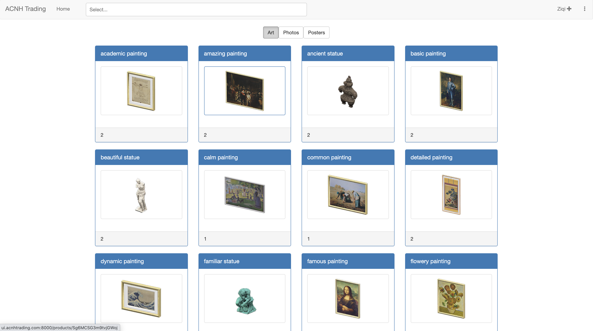
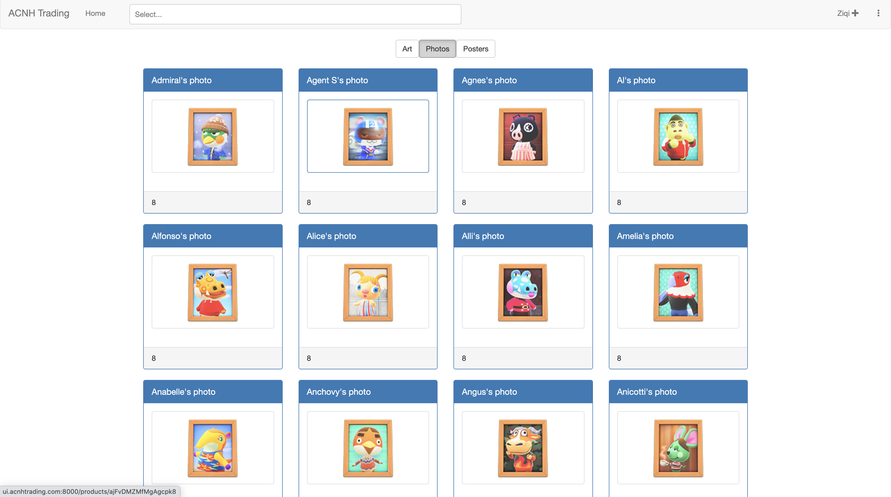
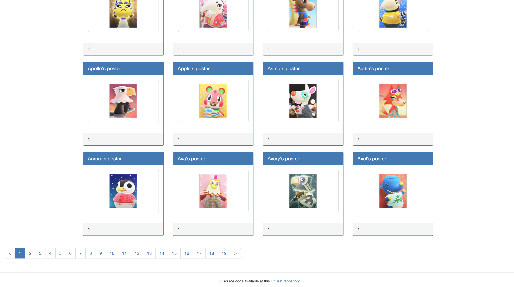
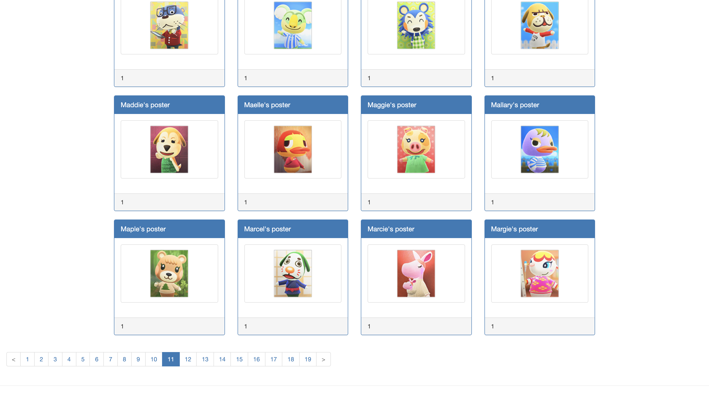
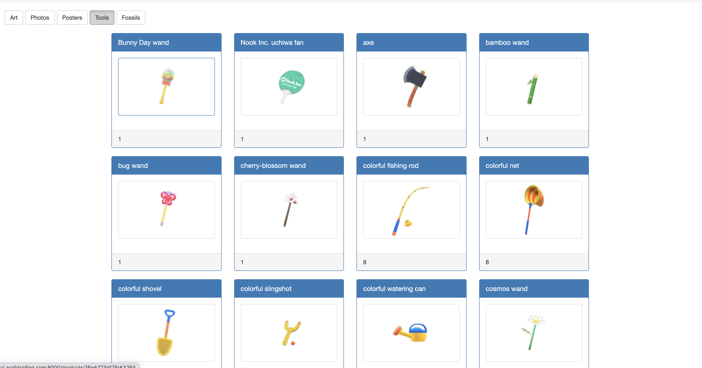
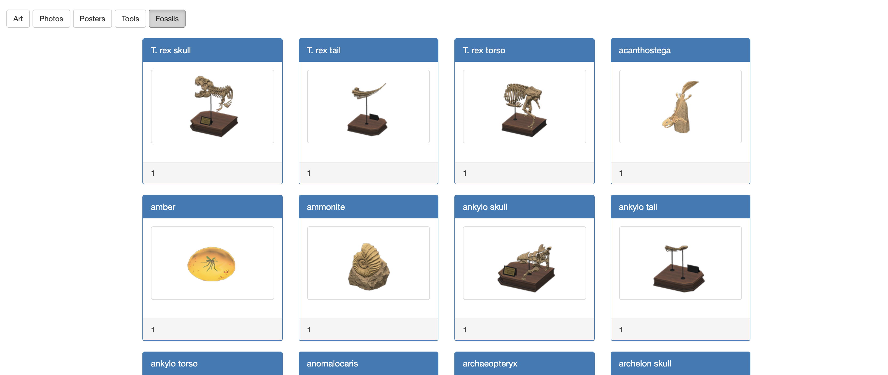

# GroupProject_ppttptsfzzsf_UI

## Team
* Shengfu Zhang
* Ziqi Tang

## Iterations 1 Progress
* We used book project as the boilerplate code and build our projects on top of that.
* We found the Animal Crossing New Horizon product spreadsheet dataset and use Json 
parse tool to load into the MongoDB Altas cluster.
* We created new schemas for different queries for our Animal Crossing products and the CRUD operations.
* We added new APIs for CRUD operations in our API server.
* For UI server, we added pages for our product category lists. The user profile page is still under construction.
* For product displaying pages, we add different components for different categories where the related API is called to 
load the data and render them using Grid and Panel.

## Snapshots and Descriptions
* Home Page(for now)

* Sign in modal

* Animal Crossing official art displaying page

* Animal Crossing official photos displaying page

* Animal Crossing official posters displaying page

* Animal Crossing official tools displaying page

* Animal Crossing official fossils displaying page

